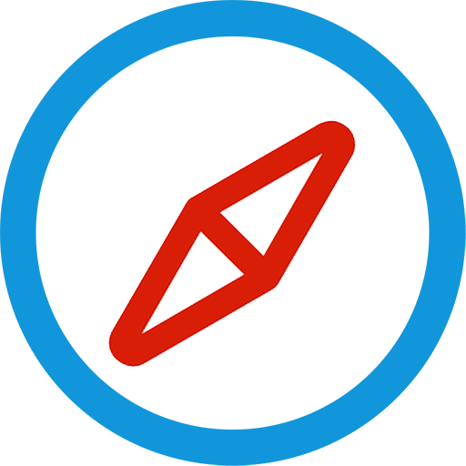

# NanoBrowser

*A custom platform/userAgent mini web browser desktop app on macOS, Windows and Linux. Built with [Electron](https://github.com/atom/electron).*

[](LICENSE)
[]()
[]()

## Features

- **Custom window.navigator.platform**
- **Custom window.navigator.userAgent**
- Update online.
- Auto/Manual Dark Mode Theme.
- Dock menu (macOS).

## How To Use

To clone and run this repository you'll need [Git](https://git-scm.com) and [Node.js](https://nodejs.org/en/download/) (which comes with [npm](https://www.npmjs.com/)) installed on your computer. From your command line:

``` bash
# Clone this repository
git clone https://github.com/ajsong/nanobrowser.git
# Go into the repository
cd nanobrowser
# Install dependencies and run the app
npm install && npm start
```
#### [Download Released App](https://github.com/ajsong/nanobrowser/releases)

#### License [MIT](LICENSE)

*NanoBrowser* is published under the MIT license. See `LICENSE` for details.
